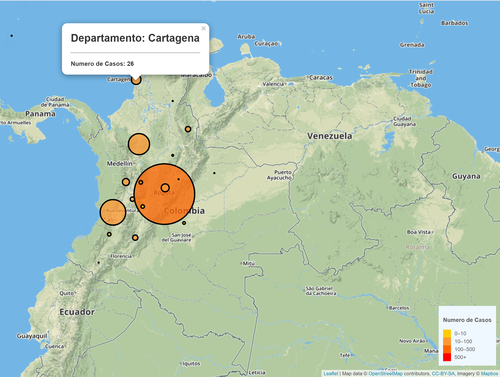
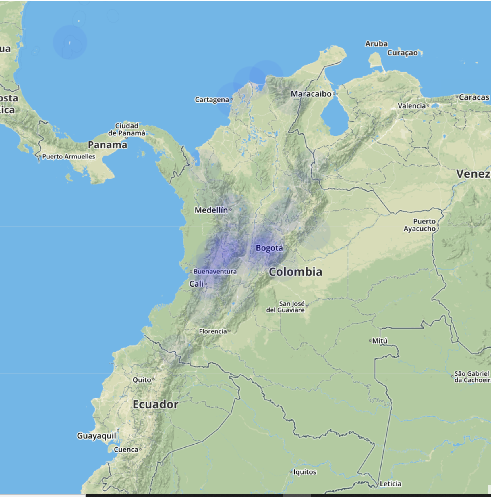

# COVID-19 Colombia
#### March 25, 2020
 

## ABOUT

In this exercise, you can visualize COVID-19 cases in Colombia until March 25, 2020. 

 The national institute of health in Colombia provides the data in a CSV format: [COVID19](https://www.ins.gov.co/Noticias/Paginas/Coronavirus.aspx). 

 
### Technology Used:
- HTML
- CSS
- Javascript

 

## INSTALL

* Clone from Github page
* In terminal or gitBash, run a git clone in desired file to save the repository.
* Run an npm install to download required packages.

## VISUALIZE

* Open Command Prompt
* Go to the directory where you saved the repository
* Press Enter
   --> You will need a HTTP server in Python, so:
 

* Type: py -m http.server
* Enter
* Go to the browser and in the address bar type: http://localhost:8000/
* Enter
* Be filled with wonder!
 

## Visualizations

* Cases in Colombia

 

* Heatmap

